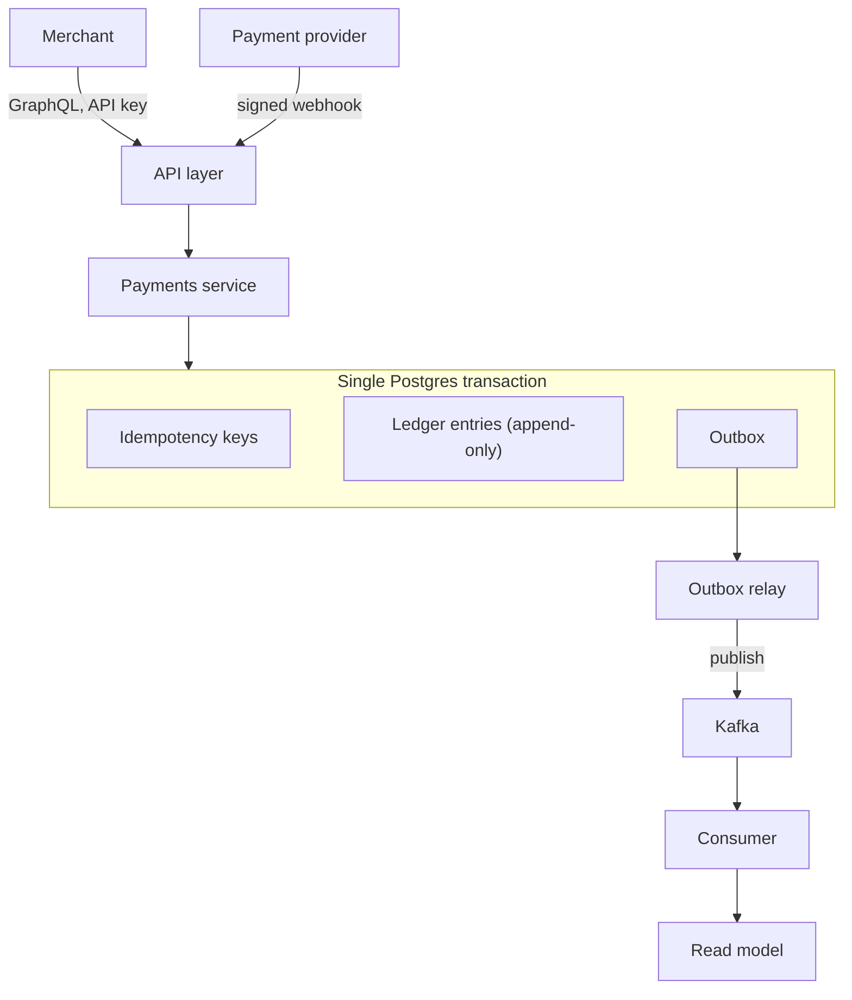

# payment-links

A small backend service where a merchant creates a payment link, a customer pays it, a payment provider confirms the payment through a webhook, and that confirmation is propagated to other services. It is built with the stack from Ziina's Backend Engineer role — TypeScript, Nest.js, PostgreSQL, GraphQL, and Kafka — and treats correctness around money as its first constraint.

It is the applied companion to [account-ledger-core](https://github.com/rebase-master/account-ledger-core), a separate repository that works out the ledger logic on its own: money as integer minor units, append-only entries, and value-dated corrections. Where that project is the reasoning in isolation, this one puts the same reasoning inside a running service.

## Architecture



A request arrives either through the GraphQL API, where a merchant acts on their own links, or through a webhook, where a payment provider confirms a payment. Both funnel into one payments service that does its work inside a single database transaction and defers any asynchronous follow-up to an outbox. A relay drains that outbox to Kafka, and downstream consumers build their own read models from the resulting events.

## Design notes

**Idempotency.** Creating or paying a link is safe to retry. Each request carries an idempotency key that the service stores before it does any work, so a duplicate request — a network retry, an impatient second tap — returns the original outcome instead of repeating the effect.

**Transactional outbox.** When a payment is recorded, the ledger entries and the event that announces the payment are committed together, in the same transaction; the relay publishes those events afterwards. This closes the gap in the naive approach, where writing to the database and publishing to Kafka are two separate steps and a failure between them either loses an event or invents one.

**Webhook verification.** Provider callbacks are verified against the raw request body before they are trusted, keep working across a rotation of the signing secret, and ignore repeat deliveries. Their responses are chosen so that a provider retries only when retrying could actually change the outcome.

**Observability.** Every request is logged with a correlation id, health is exposed as separate liveness and readiness checks, and operational counters are published in Prometheus format. The service is meant to be watched in production, not only to pass its tests.

## Project structure

The code is organised by domain rather than by technical layer. Each area — merchants, payment links, payments, webhooks, and the outbox relay — is its own Nest module, and cross-cutting concerns such as configuration, database access, logging, and health checks live in their own modules and are shared through dependency injection.

## Running locally

```bash
npm install
cp .env.example .env
docker compose up -d      # PostgreSQL
npm run start:dev
```

- `npm test` — unit tests; `npm run test:e2e` — end-to-end tests against the app
- `GET /health/live`, `GET /health/ready` — liveness, and readiness (which checks the database)
- `GET /metrics` — Prometheus-format metrics. Scrape from an internal network only; it exposes process internals and should not sit behind the public ingress.

## Deliberately out of scope

Redis, Elasticsearch, Kubernetes, and Terraform are part of the target stack but are intentionally left out. Nothing here is read-heavy enough to warrant a cache, there is no search surface to index, and the orchestration and infrastructure-as-code layers are better demonstrated against a real deployment than mocked up in a sample.
